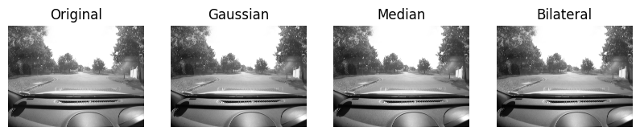
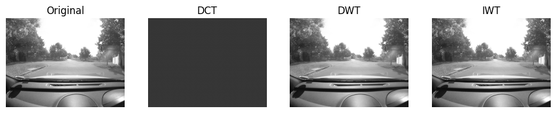
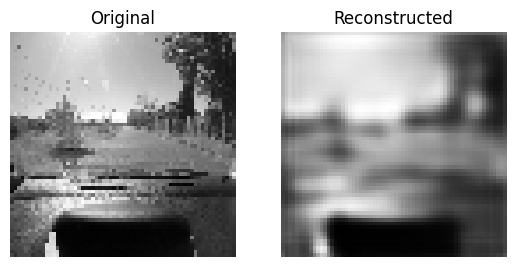
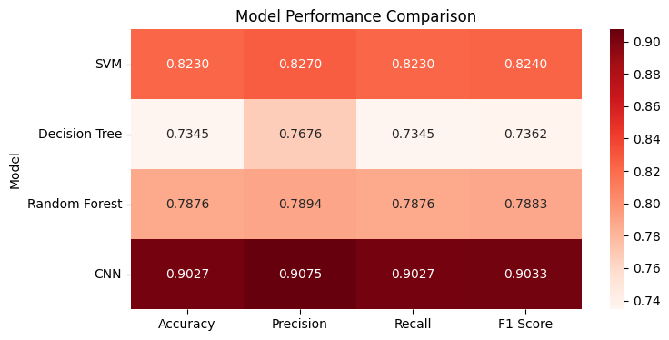
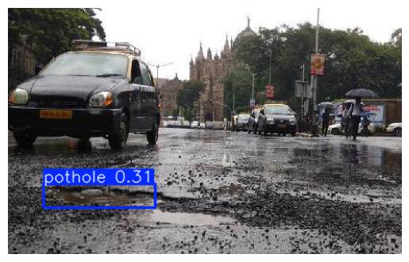

# 🚧 Pothole Detection using Machine Learning & Deep Learning

[](LICENSE)
[](https://www.python.org/)
[](https://www.tensorflow.org/)
[](https://github.com/ultralytics/ultralytics)

A comprehensive implementation of pothole detection using various machine learning classifiers and deep learning models, culminating in real-time object detection with YOLOv8.

---

## 📋 Table of Contents
- [Overview](#overview)
- [Features](#features)
- [Dataset](#dataset)
- [Methodology](#methodology)
- [Results](#results)
- [Installation](#installation)
- [Usage](#usage)
- [Project Structure](#project-structure)
- [Model Performance](#model-performance)
- [Sample Outputs](#sample-outputs)
- [Technologies Used](#technologies-used)
- [Future Work](#future-work)
- [Contributing](#contributing)
- [License](#license)
- [Contact](#contact)

---

## 🎯 Overview

This project explores multiple approaches to pothole detection, comparing traditional machine learning techniques with modern deep learning architectures. The implementation includes:
- Image preprocessing and filtering techniques
- Feature extraction using DCT and DWT
- Classification using SVM, Decision Tree, Random Forest, and CNN
- Image reconstruction using Autoencoders
- Real-time object detection using YOLOv8

---

## ✨ Features

- **Multi-Filter Image Processing**: Gaussian, Median, and Bilateral filtering
- **Transform-Based Compression**: DCT, DWT, and IWT implementations
- **Multiple ML Classifiers**: Comprehensive comparison of SVM, Decision Tree, and Random Forest
- **Deep Learning Models**: CNN for classification and Autoencoder for reconstruction
- **YOLOv8 Integration**: State-of-the-art object detection for real-time pothole identification
- **Performance Visualization**: Detailed heatmaps and metrics comparison

---

## 📊 Dataset

### Dataset 1: Simplex Dataset
- **Training Data**: Positive and Negative samples
- **Test Data**: Separate test set for validation
- **Image Format**: Grayscale images (64×64)

### Dataset 2: Pothole YOLOv8 Dataset
- **Source**: Roboflow Pothole Dataset
- **Format**: YOLOv8 format with annotations
- **Split**: Train, Validation, and Test sets
- **Classes**: Pothole (1 class)

---

## 🔬 Methodology

### 1. Image Preprocessing
Applied multiple filtering techniques to enhance image quality:
- **Gaussian Blur**: Reduces noise using Gaussian kernel (5×5)
- **Median Filter**: Removes salt-and-pepper noise (kernel size: 5)
- **Bilateral Filter**: Edge-preserving smoothing (d=9, σ=75)



### 2. Compression Techniques
Implemented transform-based compression methods:
- **DCT (Discrete Cosine Transform)**: Frequency domain representation
- **DWT (Discrete Wavelet Transform)**: Haar wavelet decomposition
- **IWT (Inverse Wavelet Transform)**: Reconstruction from wavelet coefficients



### 3. Feature Extraction
- Extracted first 100 DCT coefficients
- Extracted first 100 DWT approximation coefficients
- Combined features: 200-dimensional feature vector per image

### 4. Machine Learning Classification
Trained and evaluated three classical ML models:
- **Support Vector Machine (SVM)**: Linear kernel
- **Decision Tree Classifier**: Default parameters
- **Random Forest Classifier**: 100 estimators

### 5. Deep Learning Classification
- **CNN Architecture**:
  - Conv2D (32 filters, 3×3) → MaxPooling (2×2)
  - Conv2D (64 filters, 3×3) → MaxPooling (2×2)
  - Flatten → Dense (128) → Dropout (0.5) → Dense (1, sigmoid)
- **Training**: 10 epochs, batch size 32, binary cross-entropy loss

### 6. Autoencoder for Reconstruction
- **Encoder**: Conv2D layers with MaxPooling for compression
- **Decoder**: Conv2D layers with UpSampling for reconstruction
- **Purpose**: Learn compressed representation and reconstruct images



### 7. YOLOv8 Object Detection
- **Model**: YOLOv8n (nano version) pre-trained weights
- **Training**: 50 epochs, 640×640 image size, GPU acceleration
- **Dataset**: Custom pothole dataset in YOLOv8 format

---

## 📈 Results

### Classification Performance

| Model | Accuracy | Precision | Recall | F1 Score |
|-------|----------|-----------|--------|----------|
| **SVM** | 82% | 0.83 | 0.82 | 0.82 |
| **Decision Tree** | 73% | 0.77 | 0.73 | 0.74 |
| **Random Forest** | 79% | 0.79 | 0.79 | 0.79 |
| **CNN** | **90%** | **0.91** | **0.90** | **0.90** |



### YOLOv8 Detection Performance
- **Precision**: 81.6%
- **Recall**: 68.8%
- **mAP50**: 77.8%
- **mAP50-95**: 50.5%
- **Inference Speed**: ~42.4ms per image



### Key Findings
✅ **CNN outperformed all traditional ML models** with 90% accuracy  
✅ **SVM showed strong performance** (82% accuracy) among classical methods  
✅ **YOLOv8 achieved 77.8% mAP50**, suitable for real-time detection  
✅ **Autoencoder successfully reconstructed images** with minimal loss

---

## 🚀 Installation

### Prerequisites
- Python 3.8 or higher
- CUDA-compatible GPU (optional, for faster training)
- Google Colab (recommended) or local Jupyter environment

### Setup

1. **Clone the repository**
   ```bash
   git clone https://github.com/jiban234/pothole-detection.git
   cd pothole-detection
   ```

2. **Install dependencies**
   ```bash
   pip install -r requirements.txt
   ```

3. **Download the datasets**
   - Mount Google Drive or download datasets manually
   - Update dataset paths in the notebook

4. **Run the notebook**
   ```bash
   jupyter notebook minor_project.ipynb
   ```
   Or upload to [Google Colab](https://colab.research.google.com/)

---

## 💻 Usage

### Training Models

```python
# For traditional ML models (SVM, DT, RF)
python train_ml_models.py

# For CNN classification
python train_cnn.py

# For YOLOv8 detection
from ultralytics import YOLO
model = YOLO("yolov8n.pt")
model.train(data="path/to/data.yaml", epochs=50)
```

### Inference

```python
# Load trained YOLOv8 model
from ultralytics import YOLO
model = YOLO("runs/detect/train/weights/best.pt")

# Run inference on test image
results = model("path/to/test_image.jpg")
results[0].show()
```

---

## 📁 Project Structure

```
pothole-detection/
│
├── minor_project.ipynb          # Main Jupyter notebook
├── README.md                     # Project documentation
├── requirements.txt              # Python dependencies
├── LICENSE                       # MIT License
├── .gitignore                   # Git ignore file
│
├── images/                      # Output visualizations
    ├── 01_filter_comparison.png
    ├── 02_transform_compression_comparison.png
    ├── 03_model_performance_heatmap.png
    ├── 04_autoencoder_original_vs_reconstructed.png
    └── 05_yolo_pothole_detection_result.png

```

---

## 📊 Model Performance

### Detailed Classification Reports

#### CNN (Best Model)
```
              precision    recall  f1-score   support
           0       0.95      0.88      0.91        67
           1       0.84      0.93      0.89        46
    accuracy                           0.90       113
```

#### SVM
```
              precision    recall  f1-score   support
           0       0.87      0.82      0.85        67
           1       0.76      0.83      0.79        46
    accuracy                           0.82       113
```

#### Random Forest
```
              precision    recall  f1-score   support
           0       0.83      0.81      0.82        67
           1       0.73      0.76      0.74        46
    accuracy                           0.79       113
```

---

## 🖼️ Sample Outputs

### Image Preprocessing

*Comparison of different filtering techniques*

### Transform Compression

*DCT, DWT, and IWT transformations*

### Model Comparison

*Performance metrics heatmap*

### Autoencoder Reconstruction

*Original vs reconstructed images*

### Pothole Detection

*YOLOv8 detection result with bounding box*

---

## 🛠️ Technologies Used

- **Python 3.11**: Primary programming language
- **OpenCV**: Image processing and computer vision
- **NumPy**: Numerical computations
- **Matplotlib & Seaborn**: Data visualization
- **scikit-learn**: Machine learning algorithms
- **TensorFlow/Keras**: Deep learning framework
- **PyTorch**: Deep learning backend
- **Ultralytics YOLOv8**: Object detection
- **PyWavelets**: Wavelet transforms
- **Pandas**: Data manipulation
- **Google Colab**: Cloud-based Jupyter environment

---

## 🔮 Future Work

- [ ] Implement real-time video stream detection
- [ ] Deploy model as web application using Flask/FastAPI
- [ ] Integrate with mobile app for on-road detection
- [ ] Experiment with YOLOv9 and YOLOv10 architectures
- [ ] Add severity classification (mild, moderate, severe)
- [ ] Implement data augmentation for improved generalization
- [ ] Create REST API for model inference
- [ ] Add geographic coordinates for detected potholes
- [ ] Integrate with municipal reporting systems

---

## 🤝 Contributing

Contributions are welcome! Please follow these steps:

1. Fork the repository
2. Create a feature branch (`git checkout -b feature/AmazingFeature`)
3. Commit your changes (`git commit -m 'Add some AmazingFeature'`)
4. Push to the branch (`git push origin feature/AmazingFeature`)
5. Open a Pull Request

---

## 📄 License

This project is licensed under the MIT License - see the [LICENSE](LICENSE) file for details.

---

## 👤 Contact

**Jiban Jyoti Das**

- GitHub: [@jiban234](https://github.com/jiban234)
- Email: jibanjyotidas016@gmail.com

---

## 🙏 Acknowledgments

- [Ultralytics YOLOv8](https://github.com/ultralytics/ultralytics) for the object detection framework
- [Roboflow](https://roboflow.com/) for dataset management and preprocessing
- Google Colab for providing free GPU resources
- OpenCV community for excellent documentation

---

## 📚 References

1. Redmon, J., et al. "You Only Look Once: Unified, Real-Time Object Detection" (2016)
2. Goodfellow, I., et al. "Deep Learning" (2016)
3. scikit-learn: Machine Learning in Python, Pedregosa et al., JMLR 12, pp. 2825-2830, 2011
4. TensorFlow: Large-Scale Machine Learning on Heterogeneous Systems (2015)

---

<div align="center">

### ⭐ Star this repository if you found it helpful!

Made with ❤️ by [Jiban Jyoti Das](https://github.com/jiban234)

</div>
